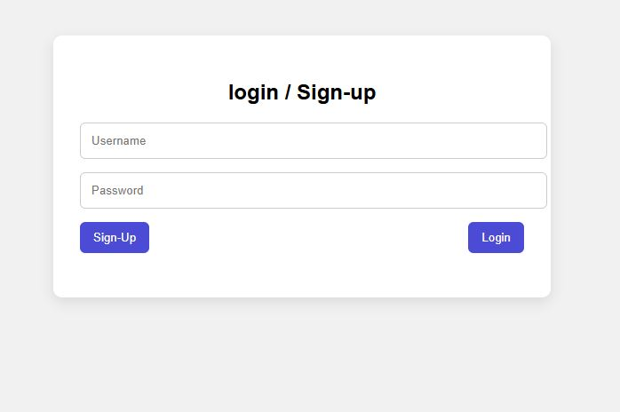
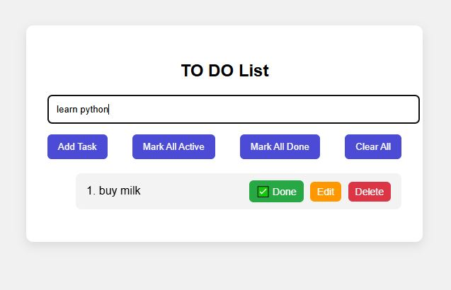

# 📝 Simple ToDo Application with User Auth (Python + HTML/CSS + JS)

This is a minimal **ToDo List Web Application** built using:
- Python HTTP server (`http.server`)
- HTML, CSS, JavaScript frontend
- Custom user authentication (register & login)
- CRUD operations for todos

---
## 📸 Screenshots

| Login / Signup                         | ToDo List                              |
|----------------------------------------|----------------------------------------|
|  |  |

---
## 🚀 Features

✅ User Registration and Login  
✅ Add, Edit, Delete tasks  
✅ Toggle task status: ✅ Active / ❌ Inactive (Done)  
✅ Mark all tasks as active or done  
✅ Clear all todos  
✅ Prevents duplicate tasks  
✅ Simple hashed password handling

---

## 🛠 Technologies Used

- **Backend**: Python `http.server`, `hashlib`, JSON handling
- **Frontend**: Vanilla JavaScript, HTML, CSS
- **No database**: Uses in-memory Python dictionaries (`users_map`, `todo_map`)

---

## 🧰 Getting Started

### Prerequisites

- Python 3.x

### Steps to Run

1. Clone the repository:
   ```bash
   git clone https://github.com/your-username/simple_todo_application.git
   cd simple_todo_application
   
2. Run the Python server:
   ```bash
   python server.py

3. Open index.html in your browser.

  - Make sure the server is running on localhost:8000 for the frontend to work correctly.

---
📂 Project Structure
---
    Simple_Todo_App/
    │
    ├── server.py            # Python HTTP server
    ├── index.html           # Frontend UI
    └── README.md            # Project Documentation

---
✅ Todo Improvements (Future Scope)
---
👉Persistent storage using files or database (e.g., SQLite, MongoDB)

👉Add user sessions / token authentication

👉Sorting/filtering todos (by status or time)

👉UI enhancements for mobile

---
🙌 Acknowledgments
---
Built by Bhanupooja — as a full-stack practice project using Python HTTP Server and JS.
